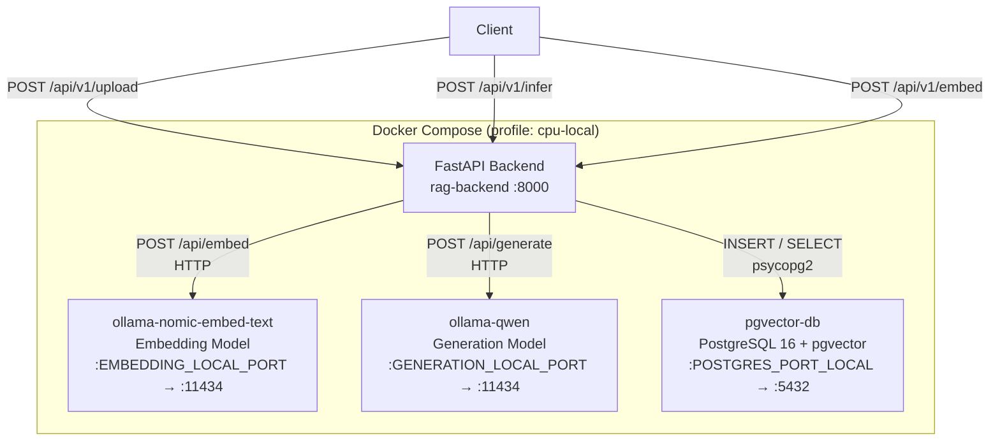
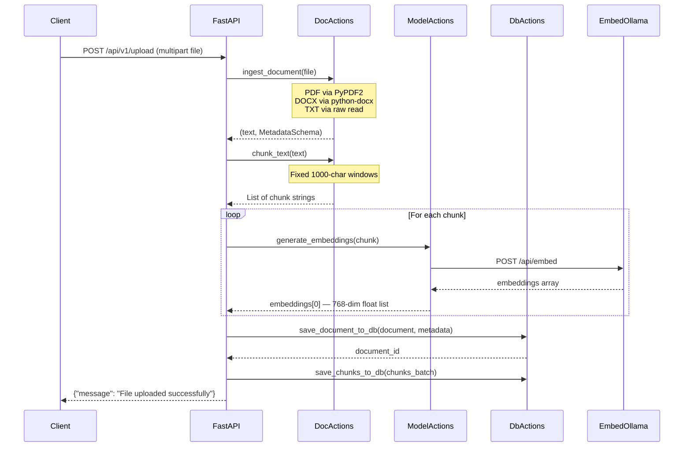
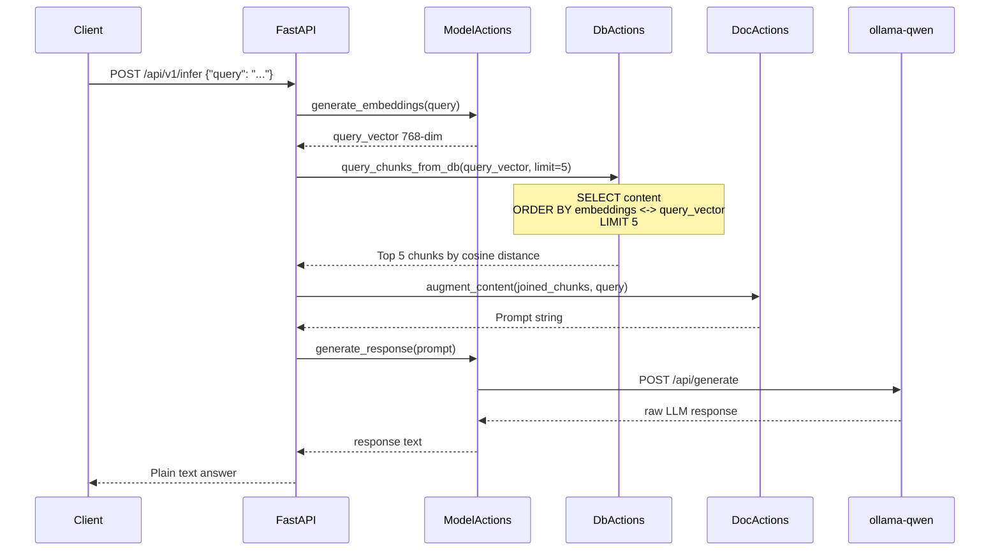
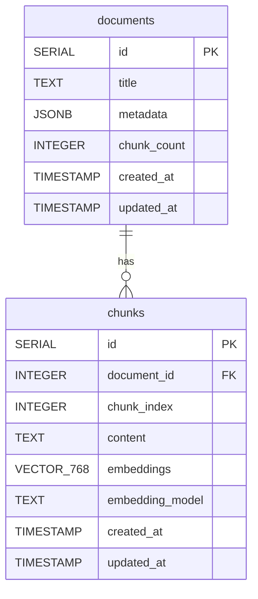

# RAG API

A from-scratch Retrieval-Augmented Generation (RAG) API built with FastAPI, local LLMs via Ollama, and PostgreSQL with the pgvector extension for vector similarity search. No LangChain or LlamaIndex — every step of the pipeline is implemented directly to expose the underlying mechanics.

---

## Table of Contents

- [Architecture](#architecture)
- [Request Flows](#request-flows)
  - [Ingestion Flow](#ingestion-flow)
  - [Inference Flow](#inference-flow)
- [API Endpoints](#api-endpoints)
- [Database Schema](#database-schema)
- [Project Structure](#project-structure)
- [Configuration Reference](#configuration-reference)
- [Getting Started](#getting-started)
- [Make Commands](#make-commands)

---

## Architecture

The system runs entirely in Docker Compose under the `cpu-local` profile. Four services communicate over Docker's internal network.




**Network communication rules:**

- Container-to-container traffic uses the service name as hostname (e.g. `http://ollama-nomic-embed-text:11434`). This is set via `EMBEDDING_URL` and `GENERATION_URL`.
- Host machine access uses `localhost` with the mapped local port (e.g. `http://localhost:8001`).

---

## Request Flows

### Ingestion Flow

Triggered by `POST /api/v1/upload`. Parses a file, splits it into fixed-size text chunks, embeds each chunk, and persists everything to PostgreSQL.




**Metadata extracted per file type:**


| Format  | Library     | Fields Available                               |
| ------- | ----------- | ---------------------------------------------- |
| `.pdf`  | PyPDF2      | `title`, `author`, `year` (from creation date) |
| `.docx` | python-docx | `title`, `author`, `year` (from created date)  |
| `.txt`  | built-in    | `title` (filename only)                        |


---

### Inference Flow

Triggered by `POST /api/v1/infer`. Embeds the user query, retrieves the most semantically similar chunks from the database, builds a prompt, and generates a response via the local LLM.




The vector similarity search uses the L2 (`<->`) operator on the HNSW-indexed `embeddings` column. The top 5 chunks are concatenated and passed to the generation model as context.

---

## API Endpoints

All endpoints are prefixed with `/api/v1`.


| Method | Path             | Request Body                         | Response             | Description                                           |
| ------ | ---------------- | ------------------------------------ | -------------------- | ----------------------------------------------------- |
| `GET`  | `/api/v1/`       | —                                    | `{"message": "..."}` | Health check                                          |
| `POST` | `/api/v1/upload` | `multipart/form-data` — field `file` | `{"message": "..."}` | Ingest a document: parse, chunk, embed, and store     |
| `POST` | `/api/v1/embed`  | `{"text": "string"}`                 | `{"result": {...}}`  | Generate a raw embedding vector for the provided text |
| `POST` | `/api/v1/infer`  | `{"query": "string"}`                | Plain text           | Query the RAG system and receive a generated answer   |


### Request / Response Examples

**Upload a document**

```bash
curl -X POST http://localhost:8000/api/v1/upload \
  -F "file=@your_document.pdf"
```

```json
{"message": "File uploaded successfully"}
```

**Generate embeddings**

```bash
curl -X POST http://localhost:8000/api/v1/embed \
  -H "Content-Type: application/json" \
  -d '{"text": "What is cosine similarity?"}'
```

**Query the RAG system**

```bash
curl -X POST http://localhost:8000/api/v1/infer \
  -H "Content-Type: application/json" \
  -d '{"query": "How does vector similarity search work?"}'
```

---

## Database Schema

Two tables are created at application startup by `src/sql/init_db.sql`.




`**documents**`

- `metadata` is stored as JSONB with a GIN index for efficient filtering.
- Supported metadata fields: `author`, `title`, `year`, `source_url`, `tags`.

`**chunks**`

- `embeddings` is a `VECTOR(768)` column (matches `nomic-embed-text` output dimensionality).
- Indexed with **HNSW** using cosine distance ops (`vector_cosine_ops`) for approximate nearest-neighbour search.
- `document_id` has a B-tree index and cascades on delete/update.

---

## Project Structure

```
rag-api/
├── config/
│   ├── database.py          # psycopg2 connection, init_db(), drop_db()
│   └── settings.py          # Reads all env vars via os.getenv
├── src/
│   ├── main.py              # FastAPI app, router registration, startup/shutdown
│   ├── controllers/
│   │   ├── uploads_controller.py    # Orchestrates ingestion pipeline
│   │   ├── inference_controller.py  # Orchestrates retrieval + generation pipeline
│   │   └── embeddings.py            # Standalone embed endpoint handler
│   ├── router/
│   │   ├── uploads_router.py        # Routes: GET /, POST /upload, POST /embed
│   │   └── inference_router.py      # Route: POST /infer
│   ├── services/
│   │   ├── doc_actions.py     # File parsing, chunking, prompt building
│   │   ├── model_actions.py   # HTTP calls to Ollama embed + generate APIs
│   │   └── db_actions.py      # All psycopg2 database operations
│   ├── schema/
│   │   ├── documents_schema.py    # DocumentSchema, ChunkSchema, MetadataSchema
│   │   ├── embeddings_schema.py   # EmbeddingsRequest, EmbeddingsResult
│   │   └── user_query_schema.py   # UserQuery, QueryEmbeddings
│   └── sql/
│       ├── init_db.sql        # CREATE TABLE / INDEX statements
│       └── drop_db.sql        # DROP TABLE / INDEX statements
├── ollama_models/
│   ├── nomic-embed-text/     # Persisted model weights (gitignored)
│   └── qwen/                 # Persisted model weights (gitignored)
├── .env                      # Your local config (not committed)
├── .env.example              # Template — copy to .env and fill in values
├── docker-compose.yml        # Service definitions
├── dockerfile                # Backend image build
├── makefile                  # Convenience commands
└── requirements.txt          # Python dependencies
```

---

## Configuration Reference

Copy `.env.example` to `.env` and fill in every value using the table below.

### General


| Variable  | Description        | Recommended Value |
| --------- | ------------------ | ----------------- |
| `VERSION` | API version string | `1.0.0`           |
| `CONFIG`  | Environment label  | `development`     |
| `ENV`     | Environment label  | `development`     |


### Ollama (shared)


| Variable             | Description                                            | Recommended Value |
| -------------------- | ------------------------------------------------------ | ----------------- |
| `OLLAMA_DOCKER_PORT` | Internal port Ollama listens on inside every container | `11434`           |


### Embedding Model


| Variable               | Description                                                        | Recommended Value                                                               |
| ---------------------- | ------------------------------------------------------------------ | ------------------------------------------------------------------------------- |
| `EMBEDDING_MODEL`      | Ollama model name to pull and use for embeddings                   | `nomic-embed-text`                                                              |
| `EMBEDDING_LOCAL_PORT` | Host port mapped to the embedding container (for local dev access) | `8001`                                                                          |
| `EMBEDDING_URL`        | URL the backend uses to reach the embedding container              | Docker: `http://ollama-nomic-embed-text:11434` / Local: `http://localhost:8001` |


> `nomic-embed-text` produces 768-dimensional vectors, which matches the `VECTOR(768)` column in the `chunks` table. If you change the model, update the SQL schema accordingly.

### Generation Model


| Variable                | Description                                                         | Recommended Value                                                   |
| ----------------------- | ------------------------------------------------------------------- | ------------------------------------------------------------------- |
| `GENERATION_MODEL`      | Ollama model name to pull and use for text generation               | `qwen2.5:3b`                                                        |
| `GENERATION_LOCAL_PORT` | Host port mapped to the generation container (for local dev access) | `8002`                                                              |
| `GENERATION_URL`        | URL the backend uses to reach the generation container              | Docker: `http://ollama-qwen:11434` / Local: `http://localhost:8002` |


> `qwen2.5:3b` requires approximately 3–4 GB of RAM. Any model available on the [Ollama model library](https://ollama.com/library) can be substituted here.

### PostgreSQL


| Variable               | Description                                                                | Recommended Value                     |
| ---------------------- | -------------------------------------------------------------------------- | ------------------------------------- |
| `POSTGRES_USER`        | Database username                                                          | `rag`                                 |
| `POSTGRES_PASSWORD`    | Database password                                                          | Choose a strong password or use `rag` |
| `POSTGRES_DB`          | Database name                                                              | `rag`                                 |
| `POSTGRES_PORT`        | Port used to construct `DATABASE_URL` inside the backend container         | `5432`                                |
| `POSTGRES_HOST`        | Hostname used inside Docker network                                        | `pgvector-db`                         |
| `POSTGRES_PORT_LOCAL`  | Host port mapped to the database (for external tools like pgAdmin or psql) | Use `5433` if `5432` is in use        |
| `POSTGRES_PORT_DOCKER` | Internal container port PostgreSQL listens on                              | `5432`                                |


> Use `POSTGRES_PORT_LOCAL=5433` if port 5432 is already occupied on your host machine.
> For local development (running the backend outside Docker), set `POSTGRES_HOST=localhost` and `POSTGRES_PORT=5433`.

### pgAdmin (optional)

pgAdmin is commented out in `docker-compose.yml` by default. To enable it, uncomment the `pgadmin` service block.


| Variable                   | Description                   | Example Value            |
| -------------------------- | ----------------------------- | ------------------------ |
| `PGADMIN_DEFAULT_EMAIL`    | Login email for pgAdmin UI    | `admin@example.com`      |
| `PGADMIN_DEFAULT_PASSWORD` | Login password for pgAdmin UI | Choose a strong password |


Once running, pgAdmin is accessible at `http://localhost:5050`.

---

## Getting Started

### Prerequisites

- [Docker Desktop](https://www.docker.com/products/docker-desktop/) (with at least 6 GB RAM allocated in settings)
- [Git](https://git-scm.com/)
- Make (included on macOS/Linux; on Windows use [Git Bash](https://gitforwindows.org/) or [WSL](https://learn.microsoft.com/en-us/windows/wsl/))

### Setup

1. **Clone the repository**
  ```bash
   git clone <repository-url>
   cd rag-api
  ```
2. **Create your environment file**
  ```bash
   cp .env.example .env
  ```
3. **Fill in `.env`** using the [Configuration Reference](#configuration-reference) table above. At minimum set `POSTGRES_PASSWORD` to something non-trivial.
4. **Build and start all services**
  ```bash
   make build
  ```
   This will:
  - Build the FastAPI backend image
  - Pull the `nomic-embed-text` and `qwen2.5:3b` models into their Ollama containers (takes several minutes on first run)
  - Start PostgreSQL with pgvector
  - Initialize the database schema automatically on first backend startup
5. **Verify the API is running**
  ```bash
   curl http://localhost:8000/api/v1/
  ```

### First Use

Upload a document:

```bash
curl -X POST http://localhost:8000/api/v1/upload \
  -F "file=@path/to/your/document.pdf"
```

Query it:

```bash
curl -X POST http://localhost:8000/api/v1/infer \
  -H "Content-Type: application/json" \
  -d '{"query": "Summarise the key points of this document"}'
```

---

## Make Commands


| Command      | Description                                                           |
| ------------ | --------------------------------------------------------------------- |
| `make build` | Build images and start all containers in detached mode                |
| `make start` | Start already-built containers without rebuilding                     |
| `make stop`  | Stop all running containers                                           |
| `make clean` | Stop containers and remove all volumes (wipes database data)          |
| `make reset` | Full teardown followed by a fresh build (`make clean` + `make build`) |


> `make clean` and `make reset` will delete all stored documents and embeddings from the database volume. Use with caution in production.
